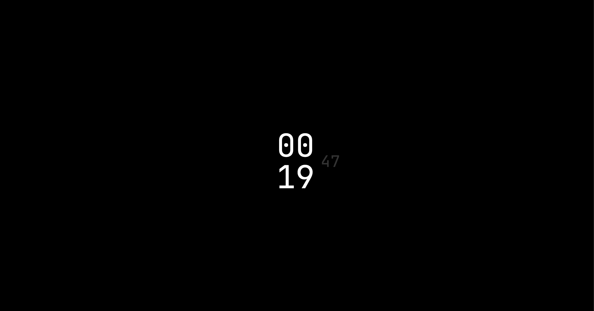
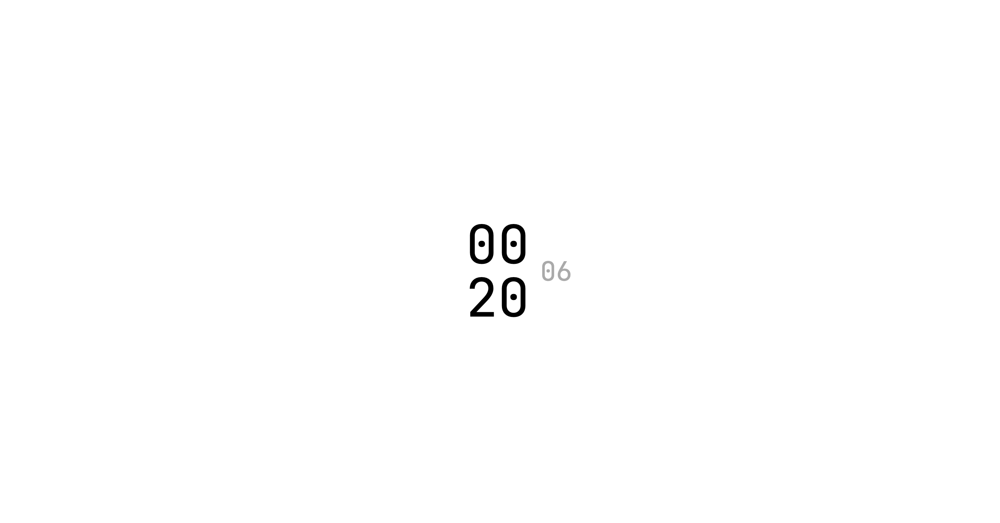

# New Tab HTML Server with PM2 Daemon

This project serves a custom HTML file that dynamically displays the current time, including hours, minutes, and seconds, designed to be used as a **new tab page** in your browser. The page supports both dark and light color schemes based on the user's system preferences. The web server is managed using PM2 to run as a daemon and start automatically on system boot.

---

## Features

- **New Tab Page:** Ideal for replacing the default new tab page of your browser with a personalized time display.
- Dynamically displays **hours, minutes, and seconds** in `HH:mm:ss` format.
- Stylish design:
  - Large font size for hours and minutes.
  - Subtle, slightly smaller font for seconds, positioned with relative alignment.
  - Seconds styled with muted gray (`#333`) for contrast.
- **Automatic Color Scheme:** Automatically adapts to your system's light or dark color scheme preferences.
  - **Dark Mode:** Black background with white text.
  - **Light Mode:** White background with black text.
- Runs on a simple Node.js server and serves the page locally at `http://localhost:1378`.
- Managed using PM2 for daemonization and startup automation.

---

## Prerequisites

1. **Node.js** installed on your system. [Download here](https://nodejs.org/).
2. **PM2** installed globally. You can install it using:
   ```bash
   npm install -g pm2
   ```

---

## Installation

1. Clone or download this project to your desired directory.
2. Place the `server.js` file and updated `index.html` file in the same directory.

### Start the Server

Run the following command in your terminal to start the server:

```bash
node server.js
```

---

## Setting Up as a Daemon with PM2

### Steps to Daemonize

1. Use the provided `deamon.sh` script to automate daemonization.
2. Grant execution permission to the script:
   ```bash
   chmod +x deamon.sh
   ```
3. Run the script:
   ```bash
   ./deamon.sh
   ```

This script will:

- Start the server with PM2.
- Save the PM2 process list.
- Configure PM2 to start on system boot.

---

## Using as a New Tab Page

To use this as your browser's new tab page:

1. Ensure the server is running and accessible at `http://localhost:1378`.
2. Check your browser's settings or install an extension that allows you to set a custom URL as the new tab page.
3. Set `http://localhost:1378` as the new tab page URL.

---

## Screenshots

### Dark Mode

The new tab page in dark mode with a black background and white text:

_Figure 1: Dark mode interface._

### Light Mode

The new tab page in light mode with a white background and black text:

_Figure 2: Light mode interface._

---

## Verifying the Setup

After running `deamon.sh`, the server will be:

- Accessible at `http://localhost:1378`.
- Automatically restarted on system reboot.

To confirm the process is running, use:

```bash
pm2 list
```

---

## Managing the Server

You can manage the server using PM2 commands:

- **Restart the server**:
  ```bash
  pm2 restart html-server
  ```
- **Stop the server**:
  ```bash
  pm2 stop html-server
  ```
- **Delete the server process**:
  ```bash
  pm2 delete html-server
  ```

---

## Notes

- **Font:** Ensure `JetBrains Mono` is available on your system or load it via a web font provider (e.g., Google Fonts) for consistent styling.
- **Customization:** Feel free to adjust the colors or sizes in the CSS for the `#seconds` element to suit your preferences.
- **Optimization:** The JavaScript in `index.html` updates the time every second using `setInterval`.

---

With this setup, you’ll have a personalized and stylish new tab page that adapts to your system's color scheme. Let me know if there’s anything else to refine!
